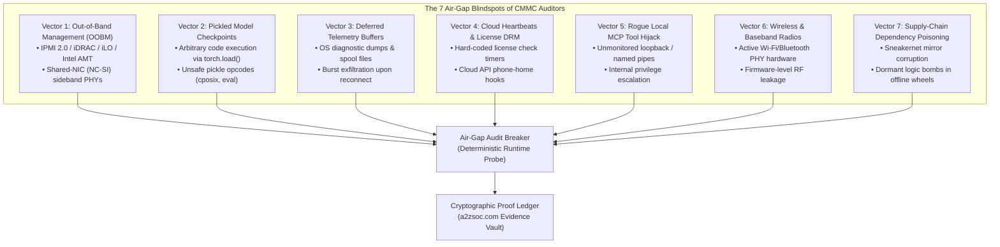

# Air-Gap Audit Breaker

[](LICENSE)
[](https://www.python.org/)
[](pyproject.toml)
[](https://a2zsoc.com)
[](https://github.com/AAH20/airgap-audit-breaker)

> **A deterministic runtime engine and physical air-gap verification sentinel that exposes fake air-gaps, hidden basebands, telemetry queues, and the Big 4 / C3PAO compliance-industrial complex. Designed for defense contractors, aerospace engineering teams, and sovereign research labs trapped in CMMC 2.0 and NIST SP 800-171 audit theater.**

---

## 1. Executive Manifesto: Deconstructing the Compliance Grift

Defense contractors, aerospace manufacturers, and intelligence labs operate in an era of rapid electronic, cyber, and kinetic warfare. Yet their limited budgets are systematically harvested by a **\$30B+ compliance-industrial complex**:

- **The Big 4 & C3PAO Audit Racket**: Management consultancies (Deloitte, PwC, EY, KPMG) and certified C3PAO auditors charge defense contractors **\$300,000 to \$1,000,000+** to produce 500-page System Security Plans (SSPs) and compliance binders. They certify enclaves as "air-gapped" and "sovereign" by checking spreadsheet checkboxes rather than probing physical hardware and network physics.
- **The "GovCloud Sovereign AI" Mirage**: When contractors require private AI for classified Controlled Unclassified Information (CUI) or ITAR data, consultants wrap cloud APIs (AWS Bedrock GovCloud, Azure OpenAI Service) and claim they are "sovereign". The second an undersea cable is severed or satellite communications are jammed, these models fail instantly due to hard-coded OAuth dependencies, telemetry pingbacks, and token metering.
- **The Capital Asymmetry Trap**: Small and medium-sized contractors bleed **40% to 70% of their operational EBITDA** paying for subjective paper audits. Meanwhile, peer adversaries deploy uncensored, open-weight models (`vllm`, `llama.cpp`) on bare-metal silicon isolated with physical optical data diodes—achieving 100x operational velocity at a fraction of the cost.

**Compliance does not equal security. Security is a property of physical isolation, immutable silicon, and mathematical invariants.**

`airgap-audit-breaker` is a zero-dependency, pure Python standard library framework that directly audits physical host machines, network interfaces, baseband microcontrollers, and neural network weights to prove whether an air-gap is genuine or a dangerous paper illusion.

---

## 2. The 7 Silent Air-Gap Exfiltration Vectors

Auditors look at unplugged Ethernet cables and locked doors. Real adversaries exploit the physics of the machine:



---

## 3. Mathematical Formulation

The engine models the reality of an enclave using three primary mathematical parameters:

### 1. Air-Gap Leakage Coefficient ($\Lambda_{\text{air}}$)
Normalized scalar field $\Lambda_{\text{air}} \in [0.0, 1.0]$, where $0.0$ represents a mathematically impenetrable air-gap, and $1.0$ represents a total sieve:

$$\Lambda_{\text{air}} = \min\left(1.0, \sum_{i=1}^{n} w_i \cdot \text{SeverityFactor}(v_i)\right)$$

Where vector weights are assigned based on physics-level severity:
- **Critical Vectors** ($w = 0.35 - 0.50$): Active default gateway, unblocked wireless PHY, executable pickle in weights, active BMC shared-NIC sideband.
- **High Vectors** ($w = 0.20 - 0.25$): Public host socket binding, Intel AMT enabled, cloud credential caches.
- **Medium Vectors** ($w = 0.08 - 0.15$): OS diagnostic telemetry spool directories, non-safetensors weight formats.

### 2. Physical Air-Gap Score ($S_{\text{physical}}$)
$$S_{\text{physical}} = 100.0 \cdot (1.0 - \Lambda_{\text{air}})$$

### 3. Compliance Deception Delta ($\Delta_{\text{deception}}$)
Quantifies the exact gap between what the Big 4 auditor certified on paper ($S_{\text{paper}}$) and what actually exists on hardware:

$$\Delta_{\text{deception}} = \max(0.0, S_{\text{paper}} - S_{\text{physical}})$$

### 4. Budget Waste Index ($\beta_{\text{waste}}$)
Measures the capital destruction ratio inflicted by advisory firms:

$$\beta_{\text{waste}} = \frac{\text{Advisory Fees Paid (USD)}}{\max(100.0, \text{True Engineering Value Delivered (USD)})}$$

$$\text{True Engineering Value} = \text{Fees Paid} \cdot (1.0 - \Lambda_{\text{air}}) \cdot \left(1.0 - \frac{\Delta_{\text{deception}}}{100.0}\right)$$

---

## 4. High-Deception NIST SP 800-171 / CMMC Controls Matrix

| Control ID | NIST Title | Big 4 / C3PAO Paper Claim | Physical Hardware Reality | Grift Rating |
| :--- | :--- | :--- | :--- | :---: |
| **AC.L2-3.1.3** | Control CUI Flow | "Firewall drops all WAN egress." | Active default gateway or IPMI BMC shared-NIC PHY bypasses OS routing. | **0.92** |
| **AC.L2-3.1.20** | External Connections | "Interfaces verified offline." | Public DNS configured (`8.8.8.8`) or non-loopback host sockets bound. | **0.88** |
| **MP.L2-3.8.1** | Media Protection | "Encrypted USB stick policy." | Model weights transferred as unverified `.pt` files containing arbitrary code execution. | **0.95** |
| **SC.L2-3.13.1** | Boundary Protection | "Physical rack locked." | BMC sideband NIC active on the primary Ethernet port; accessible via NC-SI. | **0.90** |
| **SC.L2-3.13.5** | Subnet Isolation | "VLANs properly segmented." | Subnet isolation bypassed via dual-homed adapters or link-local auto-config. | **0.85** |
| **SI.L2-3.14.1** | Flaw Remediation | "Quarterly patch cycles." | Diagnostic telemetry buffers store gigabytes of prompt logs for burst exfiltration. | **0.79** |
| **IA.L2-3.5.3** | Multifactor Auth | "Smartcards enforced on OS." | BMC/IPMI interface has default passwords or vulnerable Cipher Zero RAKP bypass. | **0.91** |
| **AU.L2-3.3.1** | Audit Log Hygiene | "Logs securely stored." | Logs queued in ephemeral local buffers waiting to auto-sync to vendor cloud. | **0.82** |
| **CM.L2-3.4.2** | Security Settings | "CIS checklists completed." | Wireless (Wi-Fi/Bluetooth) PHY controllers still powered at hardware layer. | **0.87** |
| **CA.L2-3.12.1** | Periodic Assessments | "Annual C3PAO review." | Audits conducted via interviews rather than automated hardware/telemetry probes. | **0.99** |

---

## 5. Quickstart & Installation

`airgap-audit-breaker` requires **zero external pip dependencies** and runs natively on Python 3.10+ across Linux, macOS, and BSD environments.

```bash
# Clone the repository
git clone https://github.com/AAH20/airgap-audit-breaker.git
cd airgap-audit-breaker

# Run verification unit tests
python3 -m unittest discover tests

# Optional: Install editable CLI globally
pip install -e .
```

---

## 6. Command Line Interface (CLI)

### 1. Complete Physical Air-Gap Scan
Scan the local system for active network bleed, BMC sidebands, and queued telemetry:
```bash
python3 cli.py scan \
  --enclave "DEFENSE-NODE-01" \
  --paper-score 98.0 \
  --fees 450000 \
  --verbose
```

**Terminal Output:**
```
================================================================================
        AIR-GAP AUDIT BREAKER: PHYSICAL VERIFICATION & DECEPTION SENTINEL       
         Exposing Big 4 Advisory Theater, Fake Air-Gaps & Telemetry Sinks       
================================================================================

[*] Initiating physical air-gap probe on enclave: DEFENSE-NODE-01
[*] Claimed CMMC / NIST SP 800-171 Paper Score : 98.0%
[*] Advisory / C3PAO Audit Fees Paid            : $450,000.00 USD

[+] Network Boundary Scan: 1 leak vectors detected.
[+] Baseband / BMC Scan  : 0 out-of-band management vectors detected.
[+] Telemetry Spool Scan : 2 queues detected (11,086,930 queued bytes).

================================================================================
                    PHYSICAL AIR-GAP AUDIT REPORT
================================================================================
  Target Enclave              : DEFENSE-NODE-01
  Report Serial               : AIRGAP-REP-20260926-074841
  Executive Assessment        : PAPER COMPLIANCE FRAUD: Severe breach of air-gap.
--------------------------------------------------------------------------------
  COMPLIANCE DECEPTION METRICS:
    - Paper Score Claimed     : 98.00% (Big 4 / C3PAO Checkbox)
    - Physical Air-Gap Score  : 37.00% (Actual Silicon/Network Isolation)
    - Deception Delta         : 61.00% [The Compliance Chasm]
    - Leakage Coefficient     : 0.6300 (Lambda_air: 0.0=Airgap, 1.0=Sieve)
    - Total Queued Telemetry  : 11,091,026 bytes
    - Critical Vulnerabilities: 1
--------------------------------------------------------------------------------
  FINANCIAL FORENSICS (THE COMPLIANCE GRIFT):
    - Advisory Fees Wasted    : $450,000.00 USD
    - True Engineering Value  : $64,935.00 USD
    - Budget Waste Ratio      : 6.93x multiplier
================================================================================
```

### 2. Neural Network Weight & Checkpoint Auditor
Inspect model files (`.pt`, `.bin`, `.safetensors`, `.gguf`) for executable pickle opcodes and cloud phone-home hooks:
```bash
python3 cli.py audit-weights --path /opt/models/
```

### 3. Generate Verifiable Cryptographic Attestation
Issue a SHA-256 Merkle-sealed certificate to prove compliance to DoD inspectors:
```bash
python3 cli.py attest \
  --enclave "TACTICAL-UAV-MESH" \
  --paper-score 95.0 \
  --fees 300000 \
  --output airgap_cert.json
```

---

## 7. Python API Reference

```python
from airgap_audit_breaker import (
    NetworkBleedScanner,
    OOBMDetector,
    TelemetryQueueScanner,
    WeightSanitizer,
    CMMCParityEngine,
    CryptographicReceiptIssuer
)

# 1. Run Scanners
net_vectors = NetworkBleedScanner().scan()
oobm_vectors = OOBMDetector().scan()
telem_vectors, queued_bytes = TelemetryQueueScanner().scan()
model_scans = WeightSanitizer().scan_path("/path/to/weights")

# 2. Evaluate Reality vs. Claims
engine = CMMCParityEngine()
report = engine.evaluate(
    enclave_name="SECURE-LAB-01",
    paper_score_claimed=98.0,
    advisory_fees_paid_usd=500000.0,
    telemetry_vectors=net_vectors + telem_vectors,
    oobm_vectors=oobm_vectors,
    model_scans=model_scans
)

print(f"Physical Score: {report.physical_airgap_score:.2f}%")
print(f"Deception Delta: {report.deception_delta:.2f}%")
print(f"Budget Waste Ratio: {report.budget_waste_ratio:.2f}x")

# 3. Issue Tamper-Evident Attestation
issuer = CryptographicReceiptIssuer()
cert = issuer.issue_certificate(report)
print(f"Evidence Vault URL: {cert['vault_verification_url']}")
```

---

## 8. Holding Company & Ecosystem Integration

`airgap-audit-breaker` is **Project #81** in the **A2ZSOC Global Holding Company Portfolio** under **Cluster V: Zero-Trust Security & Counter-Intelligence**.

All verification reports and certificates generated by this engine are verifiable against the **A2ZSOC Evidence Vault** (`a2zsoc.com/evidence/airgap-breaker`), rendering expensive Big 4 paper audits obsolete through deterministic cryptographic verification.

---

## 9. License

Released under the **Apache-2.0 License**. See [LICENSE](LICENSE) for details.  
Copyright © 2026 Ahmed Hassan. All rights reserved.
